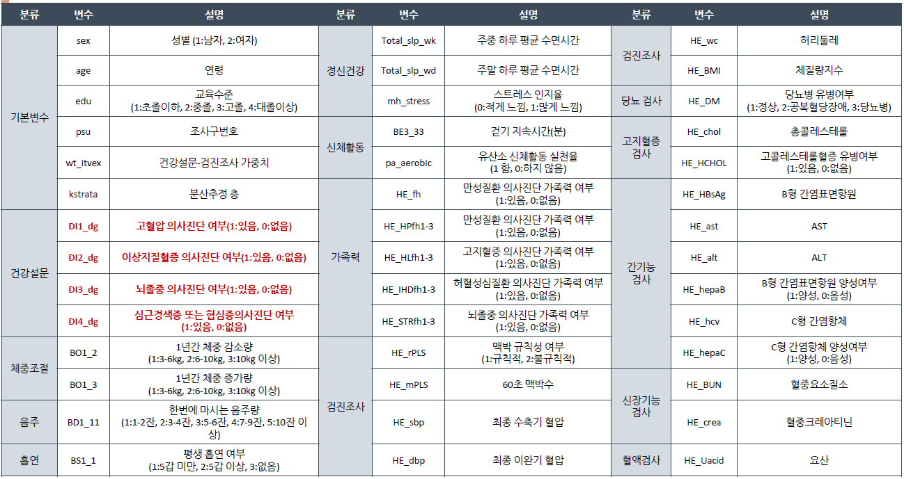

## Data

프로젝트에 사용된 데이터는 질병관리본부 국민건강영양조사 홈페이지(https://knhanes.cdc.go.kr/knhanes/main.do) 를 통해 얻을 수 있다.
7기(2016-2017년)에 행해진 데이터를 사용하였는데,
2016년 데이터는 총 8150개의 관측치와 775개의 변수, 2017년 데이터는 8127개의 관측치와 826개의 변수를 가지고 있다. 
국민건강영양조사는 설문조사를 통해 이루어졌으므로 여러 주관이 섞여있기 때문에 최대한 객관적인 수치인 변수를 선택하여 분석을 진행하였다.
분석에 사용된 데이터는 다음과 같다.



R에서는 대용량 데이터를 다루기 어려우므로 이 변수들을 추출하는 과정은 SAS를 이용하였다.
```
DATA data2016;
set 'C:\Users\User\Desktop\graduate\보건의료빅데이터\프로젝트\hn16_all.sas7bdat';
keep DI1_dg DI2_dg DI3_dg DI4_dg LW_ms edu sex age BO1_2 BO1_3 BD1 BD1_11 Total_slp_wk Total_slp_wd mh_stress BS1_1 BS3_2 BE3_33 pa_aerobic HE_fh--HE_STRfh3 HE_rPLS HE_mPLS HE_sbp HE_dbp HE_ht--HE_obe HE_DM HE_chol HE_HCHOL HE_HBsAg--HE_hepaC HE_BUN HE_crea HE_Uacid HE_Pb--HE_Cd;
run;

DATA data2017;
set 'C:\Users\User\Desktop\graduate\보건의료빅데이터\프로젝트\hn17_all.sas7bdat';
keep DI1_dg DI2_dg DI3_dg DI4_dg LW_ms edu sex age BO1_2 BO1_3 BD1 BD1_11 Total_slp_wk Total_slp_wd mh_stress BS1_1 BS3_2 BE3_33 pa_aerobic HE_fh--HE_STRfh3 HE_rPLS HE_mPLS HE_sbp HE_dbp HE_ht--HE_obe HE_DM HE_chol HE_HCHOL HE_HBsAg--HE_hepaC HE_BUN HE_crea HE_Uacid HE_Pb--HE_Cd;
run;

proc export data=data2016 
outfile = 'C:\Users\User\Desktop\graduate\보건의료빅데이터\프로젝트\data2016.csv'
dbms = dlm replace;
delimiter=",";
run;

proc export data=data2017 
outfile = 'C:\Users\User\Desktop\graduate\보건의료빅데이터\프로젝트\data2017.csv' 
dbms = dlm replace;
delimiter=",";
run;
```
***
### Data 처리
데이터 처리 과정은 R을 이용하였다.

#### Libraries
```r
library(tidyverse)
library(ranger)
library(caret)
library(ModelMetrics)
library(survey)
library(jtools)
library(ggstance)
library(InformationValue)
```

```r
data2016 <- read.csv("data2016.csv")
data2017 <- read.csv("data2017.csv")

# 만나이 19세 이상
data2016 <- data2016 %>% filter(age>=19) %>% filter(DI1_dg!=9 | DI2_dg!=9 | DI3_dg!=9 | DI4_dg!=9) %>% filter(DI3_dg!=9)
data2017 <- data2017 %>% filter(age>=19) %>% filter(DI1_dg!=9 | DI2_dg!=9 | DI3_dg!=9 | DI4_dg!=9)%>% filter(DI3_dg!=9)
data <- rbind(data2016, data2017) 
write.csv(data, file="data.csv", row.names = FALSE)

# 데이터 전처리
# NA 많은 변수 HE_Pb HE_Hg HE_Cd(중금속)
data <- data %>% select(-c(HE_Pb, HE_Hg, HE_Cd))

## 파생변수

### 순환계 질환 전부
data$DI_dg <- as.factor(ifelse(data$DI1_dg==1 | data$DI2_dg==1 | data$DI3_dg==1 | data$DI4_dg==1, 1, 0))

### 유전
data <- data %>% 
  mutate(HE_HPfh = ifelse(data$HE_HPfh1 == 1 | data$HE_HPfh2 == 1 | data$HE_HPfh3 == 1, 1, 0),
         HE_HLfh = ifelse(data$HE_HLfh1 == 1 | data$HE_HLfh2 == 1 | data$HE_HLfh3 == 1, 1, 0),
         HE_IHDfh = ifelse(data$HE_IHDfh1 == 1 | data$HE_IHDfh2 == 1 | data$HE_IHDfh3 == 1, 1, 0),
         HE_STRfh = ifelse(data$HE_STRfh1 == 1 | data$HE_STRfh2 == 1 | data$HE_STRfh3 == 1, 1, 0)) %>%
  select(-c(HE_HPfh1, HE_HPfh2, HE_HPfh3, HE_HLfh1, HE_HLfh2, HE_HLfh3, HE_IHDfh1, HE_IHDfh2, HE_IHDfh3,
            HE_STRfh1, HE_STRfh2, HE_STRfh3))

### 체중변화 - 연속형
data$BO <- ifelse(data$BO1_2 == 1, -4, ifelse(data$BO1_2 == 2, -8, ifelse(data$BO1_2 == 3, -12, 0)))
data$BO <- ifelse(data$BO1_3 == 1, 4, ifelse(data$BO1_3 == 2, 8, ifelse(data$BO1_3 == 3, 12, data$BO)))

# 음주 - 연속형
data$BD <- ifelse(data$BD1_11 == 8, 0, ifelse(data$BD1_11 == 9, NA, 2*data$BD1_11))

# 수면시간
data$Total_slp_wd <- ifelse(data$Total_slp_wd == 9999, NA, data$Total_slp_wd)
data$Total_slp_wk <- ifelse(data$Total_slp_wk == 9999, NA, data$Total_slp_wk)

# 평생 흡연
data$BS <- as.factor(ifelse(data$BS1_1 == 1 | data$BS1_1 == 2, 0, ifelse(data$BS1_1 == 9, NA, 1)))

# 걷기
data$BE <- ifelse(data$BE3_33 == 88, 0, ifelse(data$BE3_33 == 99, NA, data$BE3_33))

# age2
data$age2 <- as.factor(ifelse(data$age >= 65, 1, 0))

# 비만
data$HE_obe <- as.factor(ifelse(data$HE_BMI<18.5, 1, ifelse(data$HE_BMI<25, 2, 3)))


# factor 변환
cols <- c("sex", "edu", "DI1_dg", "DI2_dg", "DI3_dg", "DI4_dg", "mh_stress", "pa_aerobic", "HE_fh",
          "HE_rPLS", "HE_DM", "HE_HCHOL", "DI_dg", "HE_HPfh", "HE_HLfh", "HE_IHDfh",
          "HE_STRfh", "HE_hepaB", "HE_hepaC")
data[cols] <- lapply(data[cols], factor)
```
